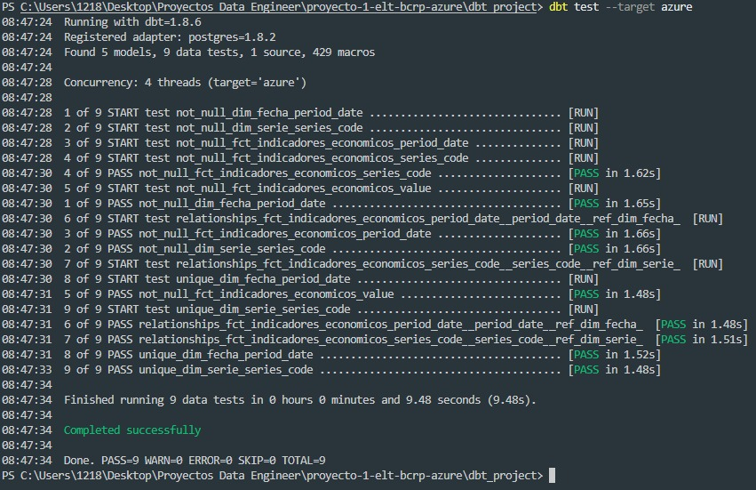
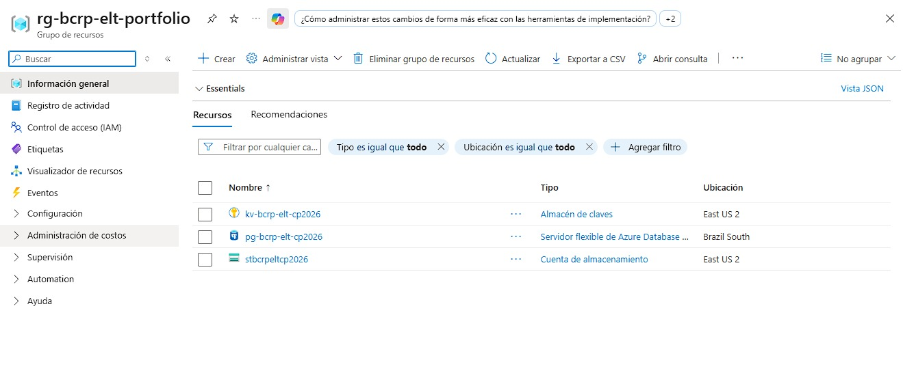
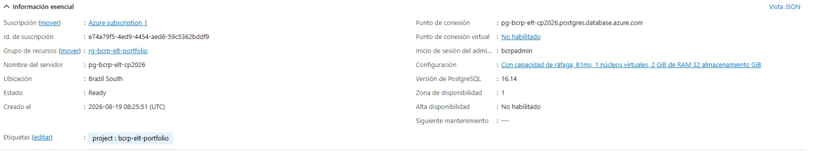
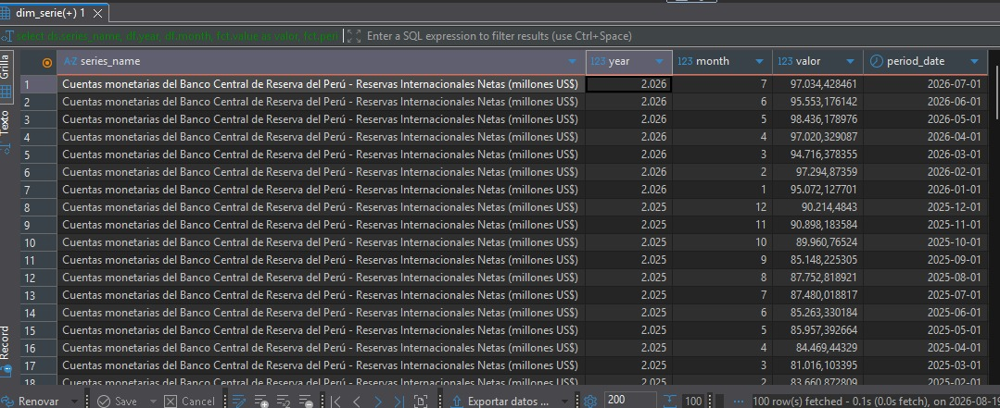

# ELT de Indicadores Económicos del Perú (BCRP) — Fase 1 local (DuckDB) → Fase 2 Azure

Pipeline ELT que extrae series estadísticas públicas del **Banco Central de Reserva del Perú (BCRP)** — tipo de cambio, reservas internacionales, inflación —, las aterriza en una capa bronze, las transforma con dbt siguiendo una arquitectura bronze/silver/gold, y provisiona la infraestructura de nube como código.


**Estado actual: el pipeline corre de punta a punta tanto en local (DuckDB) como en Azure real (ADLS Gen2 + Azure Database for PostgreSQL, desplegado con Terraform), con 9/9 tests de calidad en verde en ambos.**

## 1. Arquitectura

```mermaid
flowchart LR
    A[BCRP API] -->|extract y flatten| B[(bronze local - jsonl)]
    B -->|dbt silver, target dev| C[(silver - series limpias)]
    C -->|dbt gold, target dev| D[(gold - fct + dims)]

    subgraph FASE1[Fase 1 - Local hoy]
        B
        C
        D
        W[(DuckDB)]
        D -.materializado en.-> W
    end

    subgraph FASE2[Fase 2 - Azure ya desplegado]
        ADLS[(ADLS Gen2 - bronze landing zone)]
        PGB[(Postgres - schema bronze)]
        PGG[(Postgres - schema gold)]
    end

    B -.extract_bcrp.py sube copia.-> ADLS
    B -.load_bronze_postgres.py.-> PGB
    PGB -.dbt: silver+gold, target=azure\nmismo SQL que en local.-> PGG
```

**Capas del lago ( patrón bronze/silver/gold ):**

| Capa | Contenido | Formato hoy (local) | Formato hoy (Azure) |
|---|---|---|---|
| `bronze` | Una fila por (serie, periodo) tal como llega del API, sin tipar | `.jsonl` en `data/bronze/` (y copia en ADLS Gen2, contenedor `bronze`, como landing zone) | tabla `bronze.raw_series_bcrp` en Postgres, cargada desde el `.jsonl` local |
| `silver` | Fecha parseada a `DATE`, valor tipado a `DOUBLE`, deduplicado por extracción más reciente | vista dbt sobre DuckDB | vista dbt sobre Postgres (esquema `gold_silver`) |
| `gold` | Modelo dimensional: `fct_indicadores_economicos` + `dim_fecha` + `dim_serie` | tabla dbt sobre DuckDB | tabla dbt sobre Postgres (esquema `gold_gold`) |

**Nota:** ADLS Gen2 funciona como landing zone del dato crudo (auditoría/reproceso histórico), no como fuente de lectura para dbt — el warehouse consultable (bronze → silver → gold) vive en Postgres en la Fase 2. Es el mismo patrón que usan muchos pipelines reales: el data lake guarda el crudo tal cual llegó, y el warehouse relacional es lo que consultan BI/analistas.

## 2. Fuente de datos (verificada contra el API real)

API público del BCRP (sin autenticación): `https://estadisticas.bcrp.gob.pe/estadisticas/series/api/{codigos}/json/{fecha_ini}/{fecha_fin}/`

Series usadas en este proyecto (códigos y formato de respuesta verificados contra el API en vivo):

| Código | Serie |
|---|---|
| `PN01246PM` | Tipo de Cambio Nominal Promedio (S/ por US$) |
| `PN00027MM` | Reservas Internacionales Netas (millones US$) |
| `PN01364PM` | Índice de Precios al Consumidor — variación % mensual |

Puedes buscar más series en el [buscador de series del BCRP](https://estadisticas.bcrp.gob.pe/estadisticas/series/).

**Nota sobre el formato de periodo:** el BCRP devuelve el periodo como texto en español, ej. `"Ene.2023"`, no como fecha ISO — el modelo silver (`int_bcrp_series_cleaned.sql`) se encarga de parsearlo.

## 3. Stack

- **Fase 1 (hoy, sin costo):** DuckDB como warehouse local · dbt-core + dbt-duckdb
- **Fase 2 (Azure, ya desplegado):** Azure Data Lake Storage Gen2 (landing zone del bronze, subida desde `extract_bcrp.py`) · Azure Data Factory (o Airflow en Docker, incluido) · dbt-postgres sobre Azure Database for PostgreSQL Flexible Server · Terraform
- **Ingesta:** Python 3.11 (`requests`)
- **CI/CD:** GitHub Actions — corre `dbt run` + `dbt test` en cada PR usando DuckDB (sin necesitar credenciales de Azure)
- **Calidad de datos:** tests declarativos de dbt (`not_null`, `unique`, `relationships`)

## 4. Cómo correrlo local (ya funciona, probado con datos reales)

```bash
# 1. Entorno virtual + dependencias
python3 -m venv .venv && source .venv/bin/activate
pip install -r requirements-dev.txt

# 2. Extraer datos reales del BCRP (requiere internet; no necesita API key)
python ingestion/extract_bcrp.py --fecha-ini 2015-1 --fecha-fin 2026-8
# guarda un .jsonl en data/bronze/

# 3. Transformar y testear con dbt (target=dev -> DuckDB local, sin Azure)
cd dbt_project
export DBT_PROFILES_DIR=.
dbt run
dbt test
```

Ya hay un archivo de ejemplo versionado en `data/bronze/` con datos reales (2023–2026) por si quieres correr `dbt run`/`dbt test` sin siquiera llamar al API primero.

**Orquestado con Airflow (opcional):**

```bash
docker compose up
# UI en http://localhost:8080 (admin/admin) -> activar el DAG bcrp_elt_pipeline
```

## 5. Cómo pasar a Azure (Fase 2 — ya tienes cuenta, esto es lo que sigue)

**La forma más rápida: Azure Cloud Shell** (el ícono `>_` en la barra superior del portal). Ya viene con Terraform y Azure CLI preinstalados y ya autenticados con tu cuenta — no instalas nada en tu PC.

1. Abre Cloud Shell y elige **Bash** la primera vez que te lo pida (te pedirá crear un storage para la sesión de Cloud Shell — acepta, es gratis/mínimo).
2. Sube la carpeta `infra/` de este proyecto: botón de subir archivo (ícono de flecha hacia arriba) → sube `proyecto-1-elt-bcrp-azure.zip` → luego en la terminal:
   ```bash
   unzip proyecto-1-elt-bcrp-azure.zip
   cd proyecto-1-elt-bcrp-azure/infra
   ```
3. Revisa `variables.tf`: los nombres por defecto de `storage_account_name`, `key_vault_name` y `pg_server_name` deben ser **únicos a nivel global de Azure** — si `terraform apply` falla porque "ya existe", cámbialos (agrega tus iniciales o un número).
4. Inicializa y despliega:
   ```bash
   terraform init
   terraform apply \
     -var="pg_admin_password=TuPasswordFuerte123!" \
     -var="my_ip_address=$(curl -s ifconfig.me)"
   ```
   Esto crea: Resource Group, ADLS Gen2 (contenedores bronze/silver/gold), Key Vault, y un Azure Database for PostgreSQL Flexible Server (tier Burstable B1ms, ~$12-15/mes) que funciona como warehouse de la capa gold. Si tu IP pública cambia entre sesiones (común en Perú), vas a necesitar repetir este `apply` con la nueva IP — la regla de firewall `AllowMyIP` solo permite la IP con la que se creó.
5. Al terminar, `terraform output` te da `pg_server_fqdn` y `pg_database_name`. Copia esos valores a tu `.env` local (ver `.env.example`) como `DBT_PG_HOST` y `DBT_PG_DATABASE` (el usuario/password son los que definiste en el paso 4). También corre `terraform output storage_account_name` y `terraform output -raw storage_account_key` (este último es sensible, no se imprime completo por defecto) y cópialos como `AZURE_STORAGE_ACCOUNT_NAME` / `AZURE_STORAGE_ACCOUNT_KEY` — con esto `extract_bcrp.py` sube automáticamente una copia del bronze a ADLS Gen2 (landing zone), además de guardarlo local.
6. Desde tu máquina (no desde Cloud Shell), instala las dependencias de Fase 2, vuelve a extraer (ahora con credenciales de Storage en el entorno, para que también aterrice en ADLS) y sube el bronze a una tabla real en Postgres antes de correr dbt:
   ```powershell
   pip install -r requirements-azure.txt

   python ingestion/extract_bcrp.py --fecha-ini 2015-1 --fecha-fin 2026-8   # bronze local + copia en ADLS Gen2
   python ingestion/load_bronze_postgres.py                                 # sube data/bronze/*.jsonl a bronze.raw_series_bcrp

   cd dbt_project
   dbt run --target azure   # mismo SQL que en local, solo cambia el warehouse de destino
   dbt test --target azure
   ```
7. La tarea `subir_bronze_a_adls` del DAG de Airflow (`dags/bcrp_elt_pipeline.py`) ya llama a esta misma función (`upload_to_adls`) — si corres el pipeline vía `docker compose up` con las variables `AZURE_STORAGE_ACCOUNT_NAME`/`AZURE_STORAGE_ACCOUNT_KEY` seteadas en el contenedor de Airflow, la subida a ADLS queda automatizada de punta a punta. Pendiente: migrar la orquestación a un pipeline nativo de Azure Data Factory como alternativa a Airflow.

## 6. Capturas — pipeline corriendo en Azure real

**`dbt test --target azure` — 9/9 tests de calidad en verde, corriendo contra el warehouse cloud (no local):**



**Infraestructura provisionada como código (Terraform) — Resource Group con los 3 recursos desplegados:**



**Azure Database for PostgreSQL Flexible Server — el warehouse de la capa gold:**



**Resultado final: datos de la capa gold consultados con SQL (JOIN entre el hecho y la dimensión de series), directo desde Azure:**



## 7. Estructura del repo

```
.
├── dags/                    # DAG de Airflow (extraccion -> dbt run -> dbt test)
├── ingestion/                # extract_bcrp.py (bronze local + ADLS Gen2) + load_bronze_postgres.py (bronze -> Postgres)
├── data/
│   ├── bronze/                # datos de ejemplo reales (.jsonl) versionados en git
│   └── warehouse/              # bcrp.duckdb (generado localmente, no se versiona)
├── dbt_project/               # proyecto dbt (bronze/silver/gold), corre sobre DuckDB o PostgreSQL
├── infra/                    # Terraform: Resource Group, ADLS Gen2, Key Vault, PostgreSQL Flexible Server
├── .github/workflows/         # CI: lint + dbt run + dbt test (sobre DuckDB, sin Azure)
└── docs/                     # decisiones de diseño + docs/screenshots/ (capturas del README)
```

## 8. Estado del proyecto / TODO

- [x] Diseño de arquitectura y estructura del repo
- [x] Script de extracción + aplanado del API BCRP (bronze), probado contra el API real
- [x] Modelos dbt silver (parseo de fecha en español, tipado, deduplicación por reextracción)
- [x] Modelos dbt gold (star schema: `fct_indicadores_economicos` + `dim_fecha` + `dim_serie`)
- [x] Tests de calidad de datos (9/9 en verde: not_null, unique, relationships)
- [x] Pipeline corriendo de punta a punta en local sobre DuckDB, con datos reales
- [x] CI en GitHub Actions corriendo `dbt run` + `dbt test` automáticamente
- [x] Terraform: Resource Group + ADLS Gen2 + Key Vault + Azure Database for PostgreSQL (desplegado y probado)
- [x] Pipeline corriendo de punta a punta en Azure real (`load_bronze_postgres.py` + `dbt run --target azure`), 9/9 tests en verde
- [x] Subida del bronze a ADLS Gen2 como landing zone (`extract_bcrp.py`, función `upload_to_adls`, usada tanto desde CLI como desde el DAG de Airflow)
- [ ] Automatizar la carga a Postgres dentro de `dags/bcrp_elt_pipeline.py` (hoy `load_bronze_postgres.py` se corre manual, ver paso 6 de la sección 5)
- [ ] Activar el job `terraform-plan` en CI con credenciales de Azure como GitHub Secrets
- [ ] SCD Tipo 2 para revisiones de cifras del BCRP (convertir `fct_indicadores_economicos` en snapshot, ver nota en el modelo)
- [ ] Dashboard opcional en Power BI/Metabase conectado a la capa gold (Postgres) o a `bcrp.duckdb` en local
- [x] Capturas de pantalla del pipeline corriendo en Azure para el README y el portafolio (ver sección 6)
- [ ] `terraform destroy` cuando termines de tomar las capturas, para no seguir gastando créditos

## 9. Decisiones de diseño

- **¿Por qué DuckDB para la Fase 1?** — permite desarrollar y probar el 100% de la lógica de transformación (parseo, tipado, deduplicación, tests) sin ninguna cuenta cloud ni costo, y dbt hace el cambio de warehouse (DuckDB → PostgreSQL) casi transparente: el SQL de los modelos es el mismo (con una macro chica para la única diferencia real, `try_cast` vs `cast`), solo cambia el `target` del profile.
- **¿Por qué guardar bronze como JSON Lines en vez del JSON anidado tal cual del API?** — el API del BCRP devuelve un array de periodos con un array paralelo de valores (uno por serie). Aplanarlo a una fila por (serie, periodo) en la ingesta hace que bronze ya sea consultable como tabla (por DuckDB directo, o por una tabla real en Postgres) sin lógica adicional en SQL.
- **¿Por qué deduplicar en silver por `extracted_at` más reciente?** — el pipeline puede correr más de una vez sobre el mismo rango de fechas (reprocesos, backfills); sin esto, `fct_indicadores_economicos` tendría filas duplicadas por cada corrida.
- **Azure SQL Database + dbt-sqlserver vs. Azure Database for PostgreSQL + dbt-postgres — DECIDIDO:** se intentó primero con Azure SQL Database, pero el adaptador `dbt-sqlserver` depende de `dbt-fabric`, y se encontraron dos incompatibilidades internas no resueltas entre versiones de esos paquetes (una en el código Python al importar, otra en las macros SQL de `dbt-sqlserver` — `get_use_database_sql` no definida). En vez de perseguir versiones exactas de un adaptador de la comunidad poco estable, se migró a Azure Database for PostgreSQL Flexible Server: usa `dbt-postgres` (el adaptador más maduro de dbt, mantenido por dbt Labs), `psycopg2` no requiere ODBC ni compilador en Windows, y es el mismo motor que ya se usa en el resto del portafolio. Buen ejemplo real de cuándo conviene cambiar de herramienta en vez de seguir depurando una dependencia frágil — para mencionar en entrevista.
- **¿Por qué Burstable B1ms en vez de un tier más grande (Fase 2)?** — es el tier más económico de PostgreSQL Flexible Server (~$12-15 USD/mes) y sobra para un dataset de portafolio que se actualiza una vez al mes; se puede escalar verticalmente sin downtime si el proyecto creciera.
- **¿Para qué se usa ADLS Gen2 si el warehouse es Postgres? — DECIDIDO:** al migrar la Fase 2 de Azure SQL a PostgreSQL, `load_bronze_postgres.py` carga el bronze directo desde el `.jsonl` local a una tabla de staging en Postgres, sin pasar por ADLS — dejando el storage account provisionado en Terraform sin ningún uso real en el flujo. Se resolvió dándole una función concreta: `extract_bcrp.py` ahora también sube una copia de cada extracción a ADLS Gen2 (contenedor `bronze`) como landing zone del dato crudo — útil para auditoría/reproceso histórico, independiente de si luego se carga a Postgres, DuckDB, o a otro warehouse en el futuro. Es el mismo patrón "data lake para el crudo + warehouse relacional para lo consultable" que se usa en pipelines reales, y evita tener un recurso de infraestructura provisionado sin propósito.
